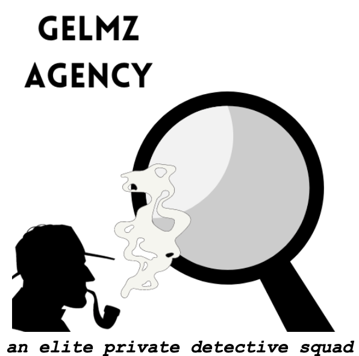

<!-- README.md is generated from README.Rmd. Please edit that file -->

```{r, include = FALSE}
knitr::opts_chunk$set(
  collapse = TRUE,
  comment = "#>"
)
```



# SDS 235: Visual Analytics - Data Challenge 1

Group Members:

- Marium Tapal
- Eleni Partakki
- Grace Hartley
- Lilly Campbell
- Zampa Provenzale


There are two main components to our analysis that you should look at:

- the final report with all the visualizations and thought process explained: `final_report.pdf`
- a folder with individual code files/folders for all the group members: `code\...`


